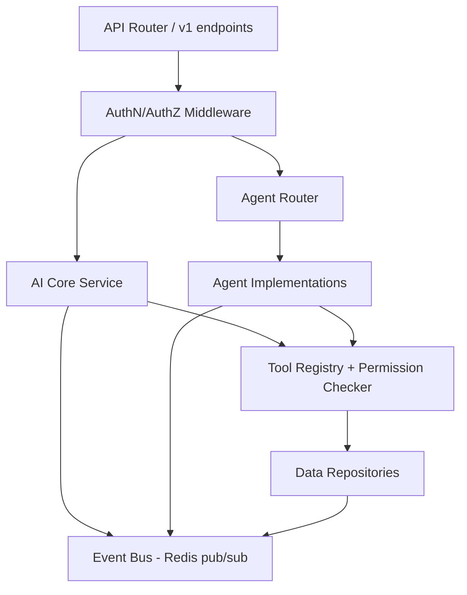

# Components

**Status:** [PLANNED]
**Owner:** Archange Elie Yatte
**Last Updated:** 2026-08-08

## Purpose

Break the `api-gateway` container into its internal components.

## Scope

Backend internals only. Frontend internals are in [03-frontend/architecture.md](../03-frontend/architecture.md).

## Backend component map



## Suggested backend structure

```text
backend/
├── api/            # FastAPI routers per domain (see 09-backend/api-design.md)
├── core/           # config, auth, dependency wiring
├── ai/             # AI Core, LLMProvider implementations
├── agents/         # agent implementations + router
├── tools/          # tool definitions + permission checks
├── modules/        # per-hub services (news, security, ...)
├── data/           # models, repositories, migrations
└── events/         # event bus wiring
```

This mirrors the frontend's feature-based structure (see [03-frontend/architecture.md](../03-frontend/architecture.md)) so a given capability has a predictable location on both sides.

## Related documentation

- [Architecture overview](overview.md)
- [Backend architecture](../09-backend/architecture.md)
- [Agent architecture](../07-agents/architecture.md)
