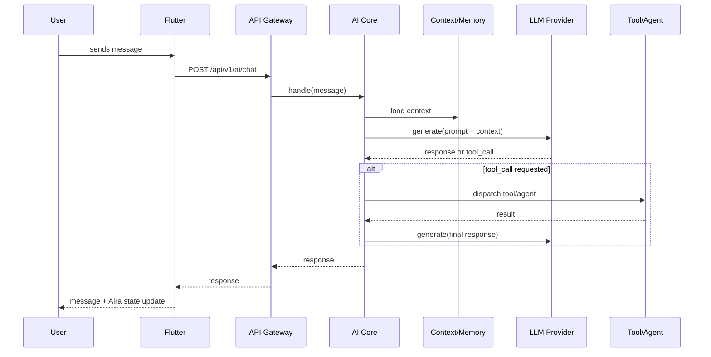
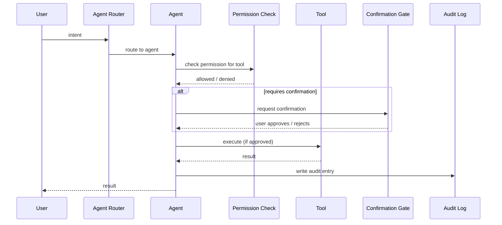
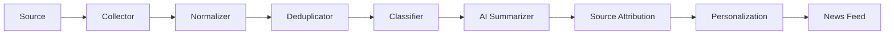
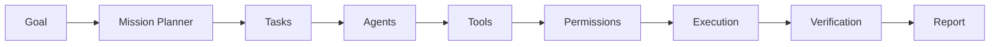

# Data Flow

**Status:** [PLANNED]
**Owner:** Archange Elie Yatte
**Last Updated:** 2026-08-08

## Purpose

Document how data moves through the system for the key end-to-end scenarios.

## Scope

Request/response-level flows. Event-driven flows are in [event-flow.md](event-flow.md).

## AI conversation flow

## Agent execution flow

## News ingestion flow

## Mission execution flow

## Related documentation

- [Event flow](event-flow.md)
- [AI architecture](../06-ai/architecture.md)
- [Agent architecture](../07-agents/architecture.md)
- [News Intelligence](../08-modules/news-intelligence.md)
- [Mission System](../08-modules/mission-system.md)
