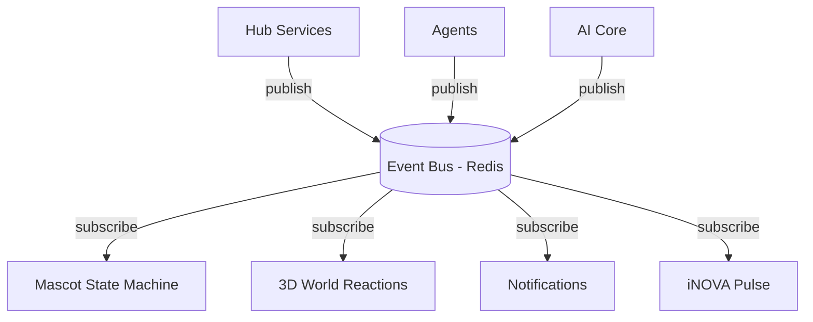

# Event Flow

**Status:** [PLANNED]
**Owner:** Archange Elie Yatte
**Last Updated:** 2026-08-08

## Purpose

Document how iNOVA's shared event system connects modules, the mascot, and the 3D world without tight coupling.

## Scope

Publish/subscribe event architecture. Request/response flows are in [data-flow.md](data-flow.md).

## Principle

Modules do not call each other directly for cross-cutting reactions (e.g. "security alert should animate the mascot"). Instead, they publish domain events to a shared bus (Redis pub/sub at MVP scale); interested consumers (mascot state machine, 3D world, notification system) subscribe.

## Example event catalog

| Event | Published by | Consumed by |
|---|---|---|
| `ai.thinking.started` / `ai.thinking.finished` | AI Core | Mascot state machine ([05-mascot/events.md](../05-mascot/events.md)) |
| `agent.task.succeeded` / `agent.task.failed` | Agent runtime | Mascot, notifications |
| `security.finding.critical` | Cybersecurity Hub | Mascot (`warning`), Watchlists, iNOVA Pulse |
| `mission.step.completed` | Mission System | Mission UI, gamification (XP) |
| `news.digest.ready` | News Intelligence | Notifications, iNOVA Pulse |

## Diagram

## Related documentation

- [Data flow](data-flow.md)
- [Mascot events](../05-mascot/events.md)
- [iNOVA Pulse](../08-modules/nova-pulse.md)
