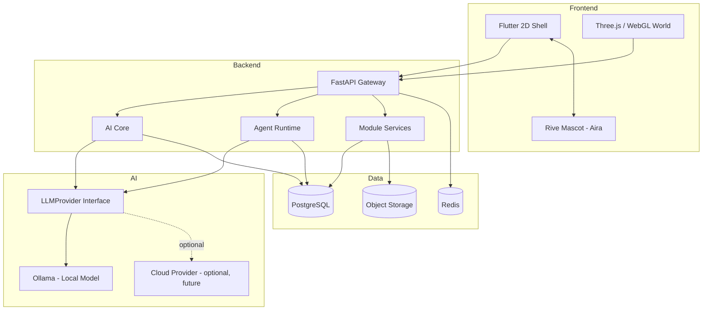

# Architecture Overview

**Status:** [PLANNED]
**Owner:** Archange Elie Yatte
**Last Updated:** 2026-08-08

## Purpose

Give the single top-level architecture diagram and the responsibility of each layer, as the entry point into `02-architecture/`.

## Scope

High-level structure only. Each box below has its own deep-dive document.

## Top-level architecture

## Layer responsibilities

| Layer | Responsibility | Must NOT do |
|---|---|---|
| Flutter shell | Navigation, 2D UI, forms, dashboards, API/WebSocket integration | Business logic, direct DB access |
| Three.js world | Visual representation, navigation, event reactions | Own any business state |
| FastAPI gateway | Auth, routing, validation, orchestration entrypoint | Contain agent reasoning logic |
| AI Core | Conversation, memory, tool dispatch | Trust LLM output blindly |
| Agent runtime | Execute permissioned, audited agent tasks | Bypass permission checks |
| Data layer | Persist normalized domain data | Store secrets in plaintext |

## Related documentation

- [System context](system-context.md)
- [Containers](containers.md)
- [Components](components.md)
- [Data flow](data-flow.md)
- [Event flow](event-flow.md)
