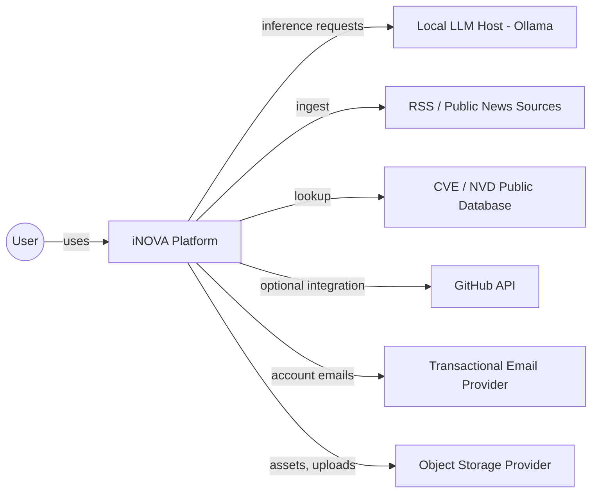

# System Context

**Status:** [PLANNED]
**Owner:** Archange Elie Yatte
**Last Updated:** 2026-08-08

## Purpose

Show iNOVA's boundary: who/what interacts with it, and what it depends on externally.

## Scope

C4-style "System Context" level — external actors and systems, no internals.

## Diagram

## External dependencies summary

See [iNOVA_CAHIER_DES_CHARGES.md](../../iNOVA_CAHIER_DES_CHARGES.md) §5 for cost/necessity detail. Architecturally relevant points:

- **LLM host is swappable** — the system boundary treats it as "a service providing completions," never as "Ollama specifically." See [llm-provider.md](../06-ai/llm-provider.md).
- **Ingestion sources are read-only, public, permissioned** — iNOVA never authenticates as the user against third-party accounts without explicit OAuth-style consent (none planned at MVP).
- **GitHub API** is optional, used by [Programming Hub](../08-modules/programming-hub.md) only, `[PLANNED]`.

## Related documentation

- [Architecture overview](overview.md)
- [Integration map](integration-map.md)
- [Containers](containers.md)
