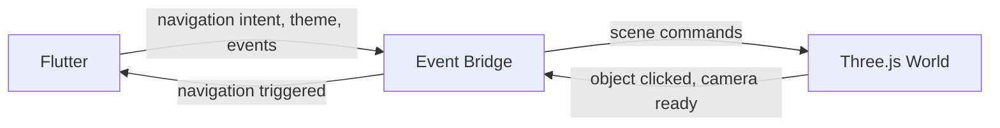

# 2D/3D Integration

**Status:** [PLANNED]
**Owner:** Archange Elie Yatte
**Last Updated:** 2026-08-08

## Purpose

Define the contract between the Flutter shell and the Three.js world so they stay decoupled.

## Scope

The bridge layer only.

## Integration model

The 3D world runs embedded (web: canvas/WebView interop; other targets: platform-appropriate embedding) and communicates with Flutter exclusively through a typed event bridge — never through shared mutable state.

## Rules

- Flutter never reaches into Three.js internals directly, and vice versa — only bridge messages.
- The bridge protocol is versioned and documented here once implemented, to avoid silent breakage between the two layers.
- Every 3D interaction that changes app state (e.g. navigating to a hub) must also work identically from the 2D UI — the 3D world is never the only path to a feature (see [performance.md](performance.md) fallback requirement).

## Related documentation

- [Architecture](architecture.md)
- [Navigation](../03-frontend/navigation.md)
- [Performance](performance.md)
