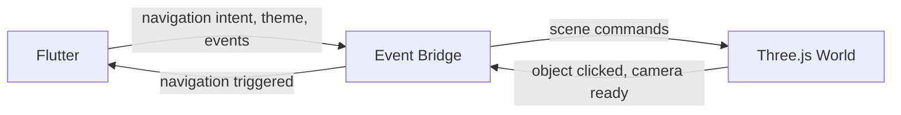

# 2D/3D Integration

**Status:** [PLANNED]
**Owner:** Archange Elie Yatte
**Last Updated:** 2026-08-08

## Purpose

Define the contract between the Flutter shell and the Three.js world so they stay decoupled.

## Scope

The bridge layer only.

## Integration model

The 3D world runs embedded (web: canvas/WebView interop; other targets: platform-appropriate embedding) and communicates with Flutter exclusively through a typed event bridge — never through shared mutable state.

## Rules

- Flutter never reaches into Three.js internals directly, and vice versa — only bridge messages.
- The bridge protocol is versioned and documented here once implemented, to avoid silent breakage between the two layers.
- Every 3D interaction that changes app state (e.g. navigating to a hub) must also work identically from the 2D UI — the 3D world is never the only path to a feature (see [performance.md](performance.md) fallback requirement).

## Gate 6 spike findings (2026-08-08)

An isolated feasibility spike validated the mechanical half of this contract: a Flutter
`HtmlElementView` hosting a Three.js scene, with commands flowing Flutter → Three.js (via
`dart:js_interop` calling into a small `three_bridge.js`) and events flowing Three.js → Flutter
(via a JS callback into Dart), both proven live and repeatedly, including in a `--release`
build. The spike did not implement the versioned bridge protocol or a navigation-triggering
event — see [Gate 6 report](../16-roadmap/gate-6-3d-spike-report.md) for measurements.

## Gate 7 — first implemented bridge contract, v1.0.0 (2026-08-08)

`frontend/web/world/world_bridge.js` + `frontend/lib/features/world/` implement a first real,
versioned instance of this contract — one object, one command, one event:

- **Version**: `bridgeVersion` (currently `"1.0.0"`), exposed as `window.iNovaWorld.bridgeVersion`
  on the JS side and `kWorldBridgeVersion` in
  `frontend/lib/features/world/application/world_bridge_interop_web.dart` on the Dart side.
  Checked once at init; a mismatch is logged (not fatal) rather than failing silently — bump
  this whenever the shape of `init`/`set*`/`dispose` or the callback payload changes.
- **Flutter → Three.js command**: `setAccentColor(hex)` — Flutter passes its own real
  `Theme.of(context).colorScheme.primary`, never a color hardcoded in JS, so the object
  visualizes real Flutter state per [architecture.md](architecture.md) "Principle".
- **Three.js → Flutter event**: a raw "object clicked" callback, no payload beyond that. Flutter
  alone decides what it means — in this increment, `Navigator.pushNamed(context,
  AppRoutes.missions)`. This is the first real exercise of this document's "navigation
  triggered" rule: Missions already has a normal 2D entry point, so the 3D path produces exactly
  the same outcome, not a 3D-only shortcut.
- **Scope note**: this is a minimal, real contract for one object/one event, not the full future
  protocol (multiple object types, camera events, richer payloads). Status stays `[PLANNED]` at
  the document level for that reason — treat this section as the current, honest snapshot of
  what's actually implemented, not the target shape.

See [Gate 7 report](../16-roadmap/gate-7-first-3d-increment-report.md) for measurements.

## Related documentation

- [Architecture](architecture.md)
- [Navigation](../03-frontend/navigation.md)
- [Performance](performance.md)
- [Gate 6 3D spike report](../16-roadmap/gate-6-3d-spike-report.md)
