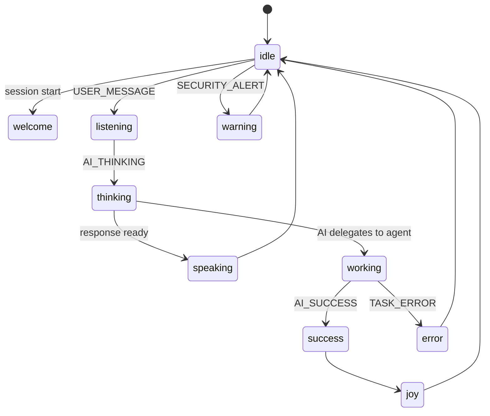

# State Machine

**Status:** [PLANNED]
**Owner:** Archange Elie Yatte
**Last Updated:** 2026-08-08

## Purpose

Define how application events map to Aira's visual states.

## Scope

Mapping logic; the states themselves are catalogued in [states.md](states.md).

## Mapping table

| Application event | Aira state |
|---|---|
| `AI_THINKING` | `THINKING` |
| `AI_SUCCESS` | `JOY` |
| `TASK_ERROR` | `ERROR` |
| `SECURITY_ALERT` | `WARNING` |
| `USER_MESSAGE` | `LISTENING` |

## Diagram

## Implementation note

This mapping is driven by the shared event bus (see [02-architecture/event-flow.md](../02-architecture/event-flow.md)), not by feature code calling the mascot directly — a feature never imports mascot code; it publishes an event and the state machine subscribes.

## Related documentation

- [States](states.md)
- [Events](events.md)
- [Event flow](../02-architecture/event-flow.md)
