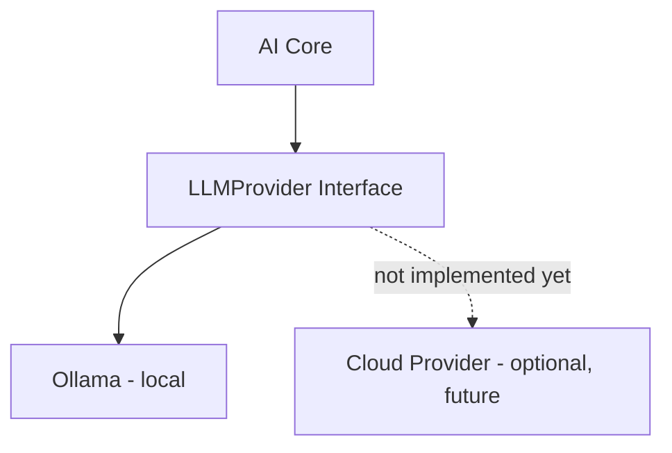

# AI Architecture

**Status:** [PLANNED]
**Owner:** Archange Elie Yatte
**Last Updated:** 2026-08-08

## Purpose

Define the shape of AI Core and the non-negotiable abstraction that keeps it provider-independent.

## Scope

AI Core structure. Agent-specific architecture is in [07-agents/architecture.md](../07-agents/architecture.md).

## Principle

The `LLMProvider` interface must allow changing model or provider without rewriting agents. This is currently a hard requirement, not an aspiration — see [llm-provider.md](llm-provider.md) and [adr/0006-llmprovider-abstraction.md](../adr/0006-llmprovider-abstraction.md).

## Current configuration

- Runtime: Ollama, local.
- Hardware constraint: ~4GB VRAM (documented as a **current**, revisable constraint — see [model-strategy.md](model-strategy.md)).
- Starting model: `qwen2.5:3b-instruct-q4_K_M`.

## Components

- [LLMProvider](llm-provider.md) — the abstraction interface.
- [Ollama](ollama.md) — the current concrete implementation.
- [Model strategy](model-strategy.md) — model selection and hardware tradeoffs.
- [Context management](context-management.md) — prompt construction.
- [Memory](memory.md) — persistence beyond a single session.
- [Retrieval](retrieval.md) — grounding responses in external/internal data.
- [Tool use](tool-use.md) — function calling contract.
- [Multimodal](multimodal.md) — non-text input handling.

## Related documentation

- [Agent architecture](../07-agents/architecture.md)
- [Data flow](../02-architecture/data-flow.md)
