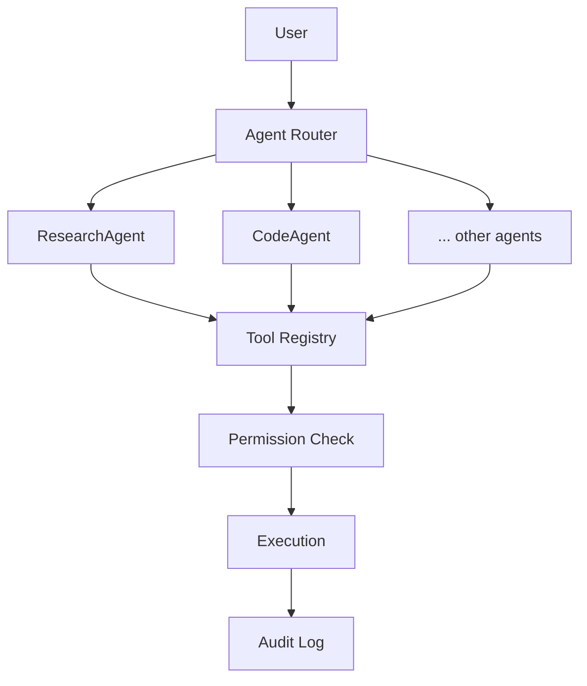

# Agent Architecture

**Status:** [PLANNED]
**Owner:** Archange Elie Yatte
**Last Updated:** 2026-08-08

## Purpose

Define what an agent is made of and how the agent system fits into the rest of iNOVA.

## Scope

Structural definition. Lifecycle is in [agent-lifecycle.md](agent-lifecycle.md); routing in [agent-router.md](agent-router.md); permissions in [permissions.md](permissions.md).

## Agent anatomy

```text
Agent
├── identity
├── purpose
├── capabilities
├── tools
├── permissions
├── memory/context
├── execution policy
├── status
└── audit trail
```

Every individual agent fiche (starting at [agents/research-agent.md](agents/research-agent.md)) documents these fields explicitly.

## Where agents sit in the architecture



## Core principle

An AI agent must never automatically gain unrestricted access to the user's system, files, network, credentials, or external services. This is enforced through scoped permissions, tool allowlists, confirmation gates, sandboxing where possible, audit logs, rate limits, and clear action previews — detailed in [permissions.md](permissions.md), [sandboxing.md](sandboxing.md), and [12-security/agent-security.md](../12-security/agent-security.md).

## Related documentation

- [Agent lifecycle](agent-lifecycle.md)
- [Agent router](agent-router.md)
- [Orchestration](orchestration.md)
- [Permissions](permissions.md)
- [Tools](tools.md)
- [Sandboxing](sandboxing.md)
- [Audit](audit.md)
- [Individual agent fiches (starting at research-agent.md)](agents/research-agent.md)
