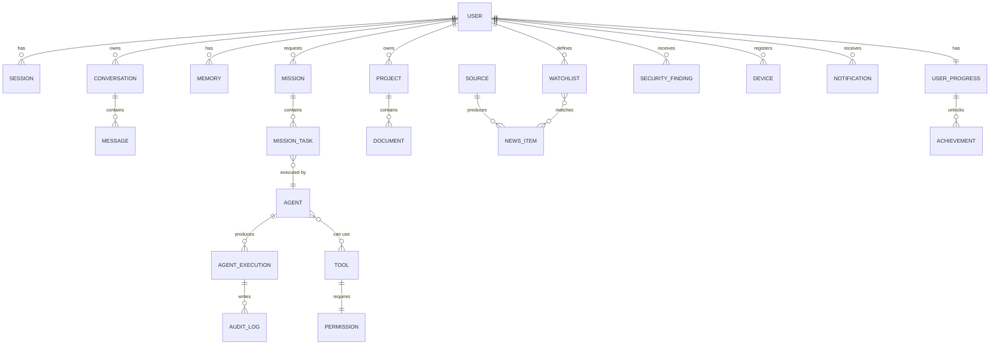

# Database Schema

**Status:** [PLANNED] — conceptual ER diagram, no migration exists
**Owner:** Archange Elie Yatte
**Last Updated:** 2026-08-08

## Purpose

Show how the entities in [entities.md](entities.md) relate to each other.

## Scope

Conceptual ER diagram. Actual migrations are tracked in [migrations.md](migrations.md) once they exist.

## Diagram

## Note

This diagram reflects the target conceptual model from [entities.md](entities.md). It will diverge from the real schema until migrations exist — always trust `migrations.md` and the actual codebase over this diagram once implementation begins, and update this file when they do.

## Related documentation

- [Entities](entities.md)
- [Migrations](migrations.md)
